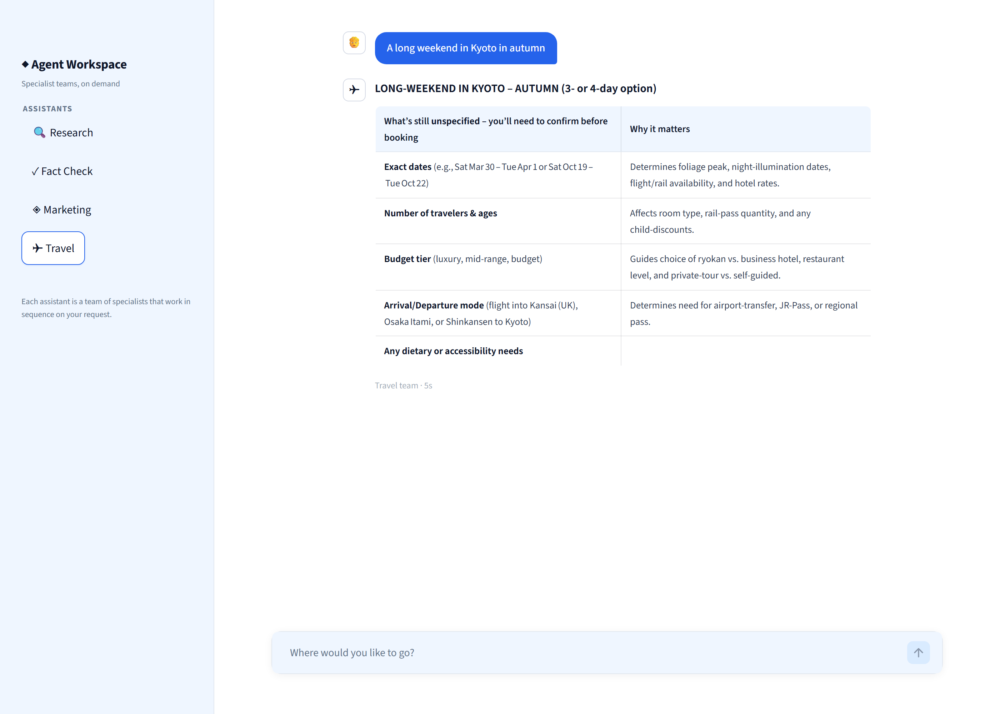
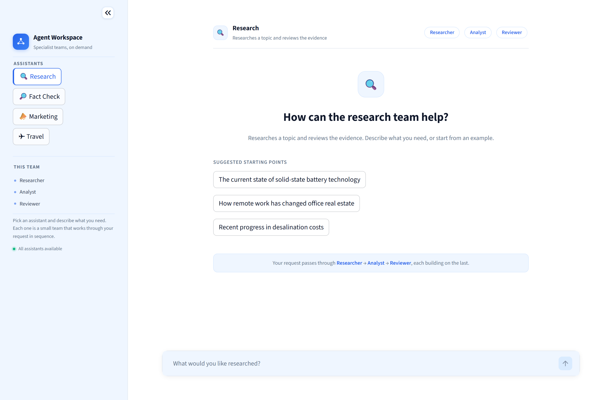

# Modular Multi-Agent Application (System Under Test)

Production-grade multi-agent system: four independently deployable modules, eleven agents in sequential pipelines, real LLM integration, distributed tracing, token accounting, optional cross-module dependencies, and deterministic failure injection.

**4 modules · 11 agents · 2 cross-module HTTP dependencies · 2 independent modules · 215 tests · 100% observability**



## Topology

| Module | Port | Agent pipeline | Depends on |
|---|---|---|---|
| **research** | 8001 | researcher → analyst → reviewer | — (independent) |
| **fact_checker** | 8002 | fact_researcher → verification | research, over HTTP |
| **marketing** | 8003 | researcher → strategist → writer | research, over HTTP |
| **travel** | 8004 | planner → search → booking | — (independent) |

- **Research** is independent, so the other two can depend on it safely.
- **Fact Checker** and **Marketing** depend on Research **over HTTP**, never by importing it. The dependency is optional: if Research is unreachable, they degrade and record the failed call.
- **Travel** is fully independent — the control case proving independent deployment does not imply a dependency.

Independent deployment and dependency are separate concerns: all four run as separate processes, containers or hosts regardless of who calls whom.

## Quick start

> Step-by-step instructions, including troubleshooting: **[RUNNING.md](RUNNING.md)**

```powershell
python -m venv .venv
.\.venv\Scripts\Activate.ps1
pip install -r requirements-dev.txt
copy .env.example .env    # then put a real key in .env
```

Set a model and key in `.env`. Any provider [litellm](https://docs.litellm.ai/docs/providers) supports works:

```ini
MODEL=gemini/gemini-2.0-flash
LLM_API_KEY=your_key_here
```

Run each module in its own terminal:

```powershell
uvicorn modules.research.server:app     --host 0.0.0.0 --port 8001
uvicorn modules.fact_checker.server:app --host 0.0.0.0 --port 8002
uvicorn modules.marketing.server:app    --host 0.0.0.0 --port 8003
uvicorn modules.travel.server:app       --host 0.0.0.0 --port 8004
uvicorn gateway.app:app                 --host 0.0.0.0 --port 8000
```

Or all five as containers:

```powershell
docker compose up --build
```

## Agent Workspace (UI)

A chat interface over the four agent modules — the demo face of the system.

```powershell
pip install -r requirements-ui.txt
streamlit run ui/app.py      # http://localhost:8501
```



Pick an assistant from the sidebar, type a request, and the specialist team works through it:


Deliberately free of telemetry — no tokens, traces, spans or status codes reach the screen. Those stay on the services' own HTTP endpoints (`/telemetry/*`) for engineers and for the external testing platform.

The UI is a **pure consumer of the public HTTP API** — it never imports module or agent code, and runs with no services up (reporting a plain message rather than an error).

In Docker it comes up alongside the rest at `localhost:8501`; module URLs come from the same `*_URL` environment variables.

## Service contract

Every module exposes the same endpoints, so all four onboard identically.

| Endpoint | Purpose |
|---|---|
| `GET /health` | Liveness, identity, uptime, whether an LLM is configured |
| `GET /metadata` | Discovery: application/module/service ids, version, agents, capabilities, dependencies, supported failure modes |
| `POST /run` | Execute the module |
| `GET /telemetry/traces` | Recent traces recorded by this service |
| `GET /telemetry/traces/{trace_id}` | One trace's full span tree |
| `GET /telemetry/tokens` | Token totals observed by this service |
| `GET /docs` | OpenAPI UI |

### `POST /run`

```jsonc
{
  "input": "Solid-state batteries are in mass production.",
  "context": null,             // optional caller-supplied context
  "failure_mode": null,        // override this service's failure mode per request
  "use_dependencies": true     // false runs the module without calling upstream
}
```

The response is a complete telemetry document — including when the run fails:

```jsonc
{
  "application_id": "multi-agent-sut",
  "module_id": "fact_checker",
  "trace_id": "6f907369b1ff70bd8b5f1a9167b20b0a",
  "request_id": "req_81c094ed36f2e850",
  "status": "ok",
  "result": "...",
  "agents": [
    {"agent_id": "fact_researcher", "status": "ok", "duration_ms": 1980.4,
     "tokens": {"input_tokens": 137, "output_tokens": 52, "total_tokens": 189,
                "source": "provider"}}
  ],
  "dependencies": [
    {"module_id": "research", "status": "ok", "http_status": 200,
     "duration_ms": 3594.7, "retry_count": 0,
     "tokens": {"total_tokens": 567, "source": "provider"}}
  ],
  "tokens": {"total_tokens": 945, "cost_usd": 0.00025875, "source": "provider"},
  "latency": {"total_ms": 7021.8, "llm_ms": 3427.0, "tool_ms": 0.0,
              "dependency_ms": 3595.4, "overhead_ms": 0.0}
}
```

## Gateway

| Endpoint | Purpose |
|---|---|
| `GET /topology` | The declared graph: modules, agents, and dependency edges |
| `GET /discovery` | Live `/metadata` fetched from every module |
| `GET /health` | Aggregate health across all four |
| `GET /telemetry/traces/{trace_id}` | One distributed trace assembled from every service that saw it |
| `POST /workflow/{research,fact-check,marketing,travel}` | Run a module through the gateway |

The gateway only holds URLs — it never imports agent code, so modules stay independently deployable.

## Features

### Real LLM Integration
- Live multi-provider support via [litellm](https://docs.litellm.ai/docs/providers): OpenAI, Anthropic, Groq, Gemini, Ollama, and 50+ others.
- No mocking: agents invoke real API calls and make real decisions.
- Graceful degradation: if the API is down, the module still records telemetry and returns an error without crashing.

### Sequential Agent Pipelines  
Four modules with 11 agents total, each specializing in a role:

| Module | Agents | Work |
|---|---|---|
| **Research** | researcher, analyst, reviewer | Gathers facts, analyzes credibility, reviews conclusions |
| **Fact Checker** | fact_researcher, verification_specialist | Researches upstream, then compares claims to facts |
| **Marketing** | market_researcher, strategist, copywriter | Studies the market, plans campaigns, writes copy |
| **Travel** | planner, search_specialist, booking_advisor | Designs itineraries, finds flights/hotels, checks availability |

Agents **sequence deterministically**: output from one feeds into the next. No nesting, no parallelism — pipeline is the unit of control.

### Cross-Module HTTP Dependencies (Optional)
- **Fact Checker** and **Marketing** depend on **Research** over HTTP at runtime.
- Dependency is **optional**: if Research is unreachable, both modules degrade gracefully, record the failure, and still produce a result.
- Calls are **real HTTP**: headers (W3C traceparent) cross service boundaries; traces stitch across services.
- **Independently deployable**: swap `RESEARCH_URL` env var to point anywhere — no code change.

### Distributed Tracing
- W3C `traceparent` header carries trace IDs across HTTP boundaries.
- Every request creates a tree of spans: per-agent, per-tool, per-LLM-call, per-service-call.
- Traces are recorded locally on each service at `/telemetry/traces/{trace_id}`.
- **No external dependency**: spans are built in-process; export is optional (OTel, Langfuse).

```text
fact_checker.request            ← trace 6f9073…
├── service_call.research       ← same trace id crosses the boundary
│     └── (recorded on :8001)
│         research.request
│         ├── agent.researcher → llm.researcher
│         ├── agent.analyst    → llm.analyst
│         └── agent.reviewer   → llm.reviewer
├── agent.fact_researcher → tool.web_search, llm.fact_researcher
└── agent.verification    → llm.verification
```

Spans are always built in-process and served from `/telemetry/*`. Export is optional: set `OTEL_EXPORTER_OTLP_ENDPOINT` (OTel collector) or `LANGFUSE_*` keys (Langfuse). With neither, nothing is shipped and nothing breaks.

### Token Accounting
- **Per-call**: every LLM call reports input, output, total tokens.
- **Source tracking**: `provider` (real), `estimated` (calculated), or `unavailable`.
- **Aggregation**: tokens roll up LLM call → agent → module → request, including downstream modules.
- **Downstream included**: if Research uses tokens, Fact Checker's total includes them.
- **No fabrication**: unknown categories stay `null`, not `0`.

### Latency Attribution
- **Wall-clock** (`total_ms`): request start to completion.
- **Self-time per category**:
  - `llm_ms` — waiting for LLM responses
  - `tool_ms` — tool execution
  - `dependency_ms` — calling downstream modules
  - `overhead_ms` — parsing, orchestration (clamped ≥ 0)
- **Non-additive**: concurrent spans can exceed total.

### JSON Logging
Every line: one JSON object with `timestamp`, `trace_id`, `request_id`, `level`, `message`, and context fields. Ready for ELK, Splunk, CloudWatch.

### Deterministic Failure Injection
Six configurable failure modes set per-service or per-request:

| Mode | Effect | Telemetry |
|---|---|---|
| `normal` | Baseline | ✓ full trace |
| `timeout` | LLM call never returns | ✓ recorded as timeout |
| `invalid_json` | LLM outputs garbage | ✓ parsing error logged |
| `http_error` | Dependency returns 500 | ✓ failed call recorded |
| `network_error` | Connection refused | ✓ retry count logged |
| `empty_response` | LLM returns empty string | ✓ retry and continue |

Every failure returns full telemetry: trace remains correlated, agents that ran are reported, tokens are counted. Dependent modules retry with exponential backoff and degrade gracefully.

```powershell
curl -X POST http://127.0.0.1:8002/run `
  -H "Content-Type: application/json" `
  -d '{\"input\":\"a claim\",\"failure_mode\":\"error\"}'
```

## Tests

```powershell
python -m compileall .
pytest
```

**215 tests**, fully offline — no API key, no network, no services running. LLM calls use a deterministic mock, so token and latency are testable and repeatable. Cross-module integration tests run the real Research app over an in-memory ASGI transport: requests are genuinely serialised, headers genuinely propagated, and traces genuinely stitched.

| Test Suite | Coverage |
|---|---|
| `test_config_and_tokens.py` | Settings, LLM routing, token counting edge cases |
| `test_telemetry.py` | Trace IDs, span trees, token aggregation, latency buckets |
| `test_service_contract.py` | `/health`, `/metadata`, `/run` responses across all four modules |
| `test_cross_module.py` | HTTP dependencies, trace continuity, token roll-up, graceful degradation |
| `test_failure_modes.py` | All six failure modes, partial-failure telemetry, retry logic |
| `test_gateway.py` | Gateway discovery, module topology, health checks |
| `test_ui.py` | Workspace UI, assistant catalogue, sidebar, chat rendering, no telemetry leakage |
| `tests/test_gateway.py` | Topology, registry, routing |
| `tests/test_config_and_tokens.py` | Configuration, token extraction, tools |
| `tests/test_ui.py` | Workspace client, assistant catalogue, and the app script |

## Layout

```text
common/
  config.py          environment-based settings
  service.py         FastAPI factory: the shared endpoint contract
  module_base.py     module runtime: orchestration, aggregation, error handling
  http_client.py     cross-service calls with trace propagation and retries
  failures.py        deterministic failure injection
  tools.py           async agent tools
  agents/            agent specs, sequential pipeline, litellm client
  telemetry/         trace context, spans, models, JSON logs, OTel export
modules/
  research/  fact_checker/  marketing/  travel/
    module.py        agent definitions and dependencies (data, not behaviour)
    server.py        ASGI entry point
gateway/             registry, topology, routing
ui/                  Streamlit workspace (api client + chat app)
deploy/              one Dockerfile per service
```

Each module's `module.py` declares *what* it is; `common/` supplies *how* it runs. Adding a module means writing one definition file and one entry point.

See [architecture.md](architecture.md) for the design rationale and [PROJECT_CONTEXT_FOR_CLAUDE_CODE.md](PROJECT_CONTEXT_FOR_CLAUDE_CODE.md) for the source-of-truth requirements.
