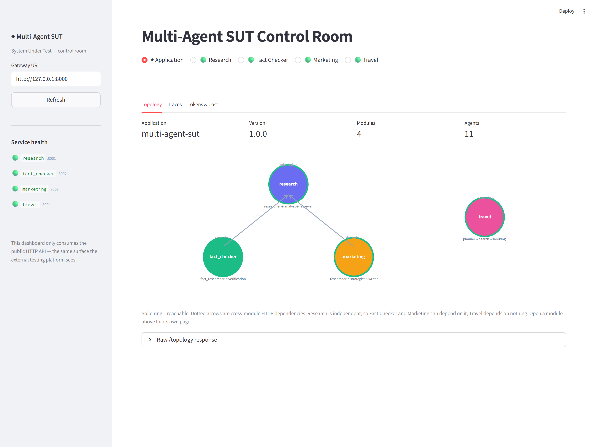
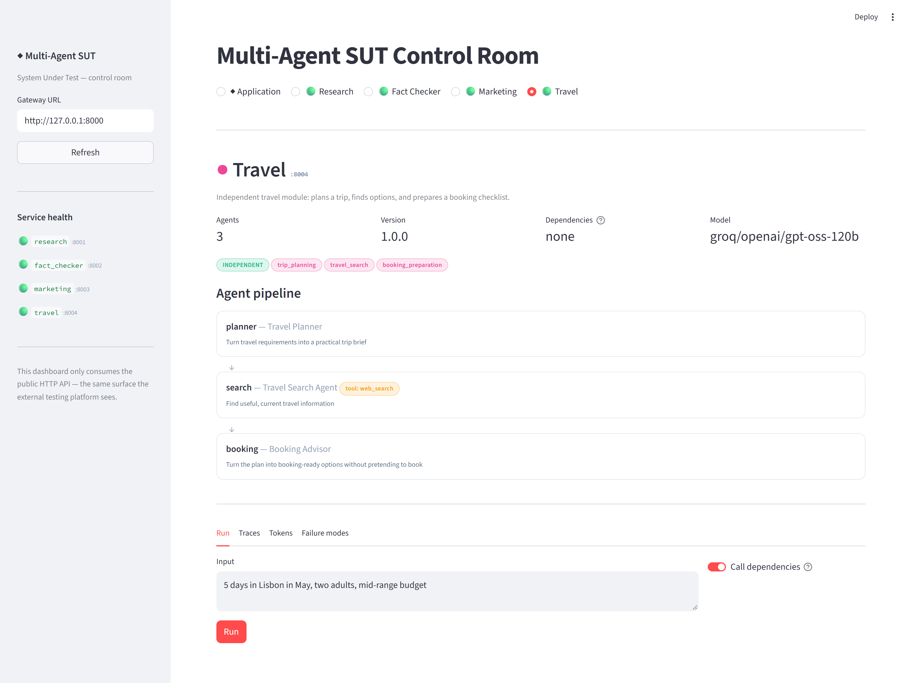
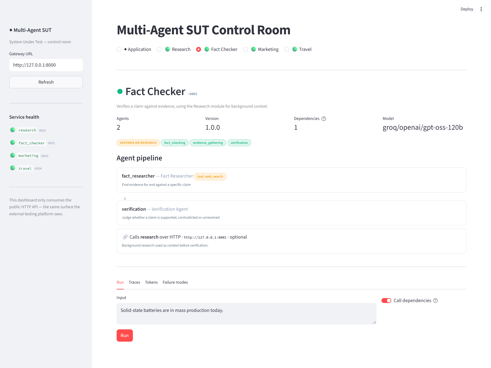
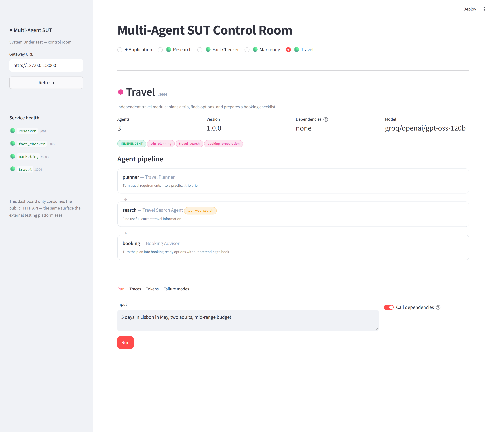
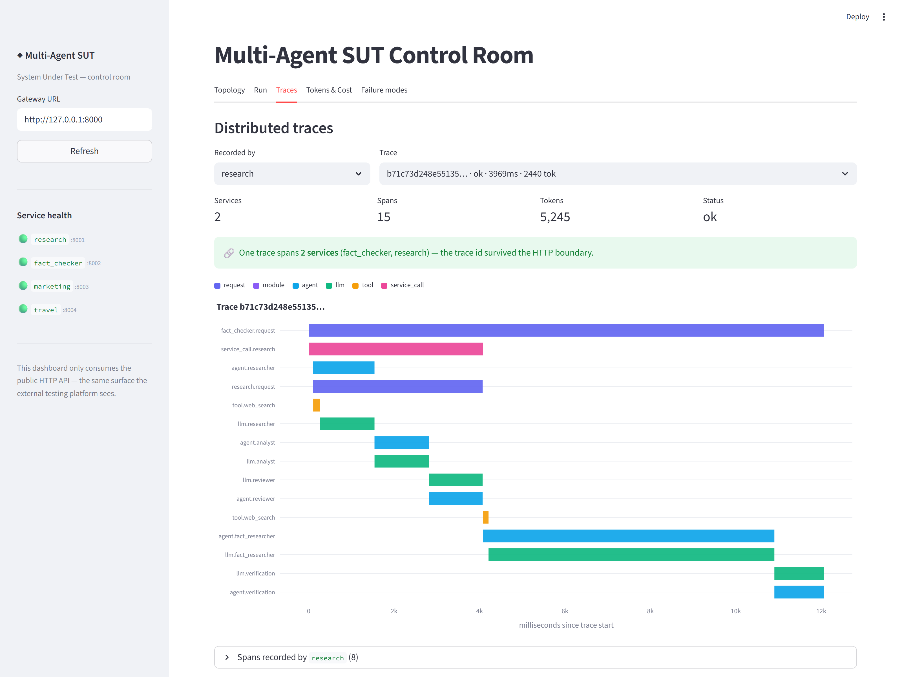
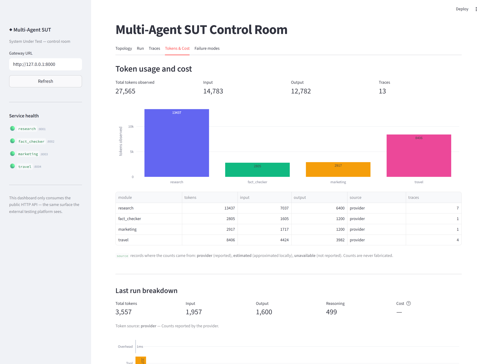
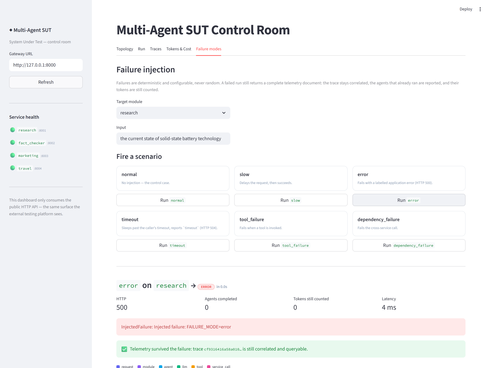

# Modular Multi-Agent Application (System Under Test)

One logical application made of four **independently deployable** agent modules, built to be onboarded, exercised and observed by an external testing platform.

This repository is the **SUT**. It is not the testing platform.

**4 modules · 11 agents · 2 cross-module HTTP dependencies · 2 fully independent modules**



## Topology

| Module | Port | Agent pipeline | Depends on |
|---|---|---|---|
| **research** | 8001 | researcher → analyst → reviewer | — (independent) |
| **fact_checker** | 8002 | fact_researcher → verification | research, over HTTP |
| **marketing** | 8003 | researcher → strategist → writer | research, over HTTP |
| **travel** | 8004 | planner → search → booking | — (independent) |

- **Research** is independent, so the other two can depend on it safely.
- **Fact Checker** and **Marketing** depend on Research **over HTTP**, never by importing it. The dependency is optional: if Research is unreachable, they degrade and record the failed call.
- **Travel** is fully independent — the control case proving independent deployment does not imply a dependency.

Independent deployment and dependency are separate concerns: all four run as separate processes, containers or hosts regardless of who calls whom.

## Quick start

> Step-by-step instructions, including troubleshooting: **[RUNNING.md](RUNNING.md)**

```powershell
python -m venv .venv
.\.venv\Scripts\Activate.ps1
pip install -r requirements-dev.txt
copy .env.example .env    # then put a real key in .env
```

Set a model and key in `.env`. Any provider [litellm](https://docs.litellm.ai/docs/providers) supports works:

```ini
MODEL=gemini/gemini-2.0-flash
LLM_API_KEY=your_key_here
```

Run each module in its own terminal:

```powershell
uvicorn modules.research.server:app     --host 0.0.0.0 --port 8001
uvicorn modules.fact_checker.server:app --host 0.0.0.0 --port 8002
uvicorn modules.marketing.server:app    --host 0.0.0.0 --port 8003
uvicorn modules.travel.server:app       --host 0.0.0.0 --port 8004
uvicorn gateway.app:app                 --host 0.0.0.0 --port 8000
```

Or all five as containers:

```powershell
docker compose up --build
```

## Dashboard

A Streamlit control room for driving and observing the system.

```powershell
pip install -r requirements-ui.txt
streamlit run ui/app.py      # http://localhost:8501
```

A bar across the top selects the scope: **◆ Application**, or one of **Research · Fact Checker · Marketing · Travel**. Each module gets its own page; the application view keeps the cross-cutting ones.

Every screenshot below is a real capture of the running system, with real LLM calls against a live provider.

### A module's own page



Each module page opens with its identity — port, agent count, model, whether it is independent — then its **agent pipeline**, each agent with its role, goal and any tools it uses. Below that are tabs scoped to that module alone: Run, Traces, Tokens, Failure modes.

A module with a dependency shows it explicitly after its agents:



### Run — drive an agent pipeline



Pick a module, type an input, press **Run**. Each agent expands to show the text it actually produced. The **Dependencies** toggle runs a module with or without its upstream call, so you can tell a module's own behaviour apart from its dependency's.

### Traces — one trace across two services



The clearest evidence in the project. One request to Fact Checker produced **15 spans across 2 processes**, reassembled under a single trace id — `research.request` and its three agents are nested inside the `service_call.research` bar. Bars sit at their real start time, so concurrent work looks concurrent.

### Tokens & Cost — honest accounting



Usage rolls up **LLM call → agent → module → request**, including tokens reported by a downstream module. Every count carries a `source` (`provider` / `estimated` / `unavailable`), and unreported values stay `null` rather than `0` — counts are never fabricated.

### Failure modes — deterministic faults



Six injectable scenarios, one click each. A failed run still returns a complete telemetry document: the trace stays correlated, agents that already ran are still listed, and their tokens are still counted.

**[Full walkthrough →](docs/DASHBOARD.md)**

The dashboard is a **pure consumer of the public HTTP API** — it never imports module or agent code, so everything it displays is exactly what the external testing platform can observe. It also runs with no services up, showing them as unreachable rather than erroring.

In Docker it comes up alongside the rest at `localhost:8501`; module URLs come from the same `*_URL` environment variables.

## Service contract

Every module exposes the same endpoints, so all four onboard identically.

| Endpoint | Purpose |
|---|---|
| `GET /health` | Liveness, identity, uptime, whether an LLM is configured |
| `GET /metadata` | Discovery: application/module/service ids, version, agents, capabilities, dependencies, supported failure modes |
| `POST /run` | Execute the module |
| `GET /telemetry/traces` | Recent traces recorded by this service |
| `GET /telemetry/traces/{trace_id}` | One trace's full span tree |
| `GET /telemetry/tokens` | Token totals observed by this service |
| `GET /docs` | OpenAPI UI |

### `POST /run`

```jsonc
{
  "input": "Solid-state batteries are in mass production.",
  "context": null,             // optional caller-supplied context
  "failure_mode": null,        // override this service's failure mode per request
  "use_dependencies": true     // false runs the module without calling upstream
}
```

The response is a complete telemetry document — including when the run fails:

```jsonc
{
  "application_id": "multi-agent-sut",
  "module_id": "fact_checker",
  "trace_id": "6f907369b1ff70bd8b5f1a9167b20b0a",
  "request_id": "req_81c094ed36f2e850",
  "status": "ok",
  "result": "...",
  "agents": [
    {"agent_id": "fact_researcher", "status": "ok", "duration_ms": 1980.4,
     "tokens": {"input_tokens": 137, "output_tokens": 52, "total_tokens": 189,
                "source": "provider"}}
  ],
  "dependencies": [
    {"module_id": "research", "status": "ok", "http_status": 200,
     "duration_ms": 3594.7, "retry_count": 0,
     "tokens": {"total_tokens": 567, "source": "provider"}}
  ],
  "tokens": {"total_tokens": 945, "cost_usd": 0.00025875, "source": "provider"},
  "latency": {"total_ms": 7021.8, "llm_ms": 3427.0, "tool_ms": 0.0,
              "dependency_ms": 3595.4, "overhead_ms": 0.0}
}
```

## Gateway

| Endpoint | Purpose |
|---|---|
| `GET /topology` | The declared graph: modules, agents, and dependency edges |
| `GET /discovery` | Live `/metadata` fetched from every module |
| `GET /health` | Aggregate health across all four |
| `GET /telemetry/traces/{trace_id}` | One distributed trace assembled from every service that saw it |
| `POST /workflow/{research,fact-check,marketing,travel}` | Run a module through the gateway |

The gateway only holds URLs — it never imports agent code, so modules stay independently deployable.

## Observability

**Distributed tracing.** Every request carries a W3C `traceparent`. A trace started at Fact Checker keeps its id through the HTTP call into Research, so both services record spans under one trace:

```text
fact_checker.request            ← trace 6f9073…
├── service_call.research       ← same trace id crosses the boundary
│     └── (recorded on :8001)
│         research.request
│         ├── agent.researcher → llm.researcher
│         ├── agent.analyst    → llm.analyst
│         └── agent.reviewer   → llm.reviewer
├── agent.fact_researcher → tool.web_search, llm.fact_researcher
└── agent.verification    → llm.verification
```

Spans are always built in-process and served from `/telemetry/*`. Export is opt-in: set `OTEL_EXPORTER_OTLP_ENDPOINT` for any OTLP collector, or `LANGFUSE_PUBLIC_KEY`/`LANGFUSE_SECRET_KEY` for Langfuse. With neither set, nothing is shipped and nothing breaks.

**Tokens** are captured per LLM call and aggregated per agent → module → request, including any usage reported by a downstream module. Every count carries a `source`:

- `provider` — reported by the provider
- `estimated` — locally approximated, never presented as exact
- `unavailable` — not obtainable

Counts are never fabricated. Categories the provider does not report (cached, reasoning) stay `null` rather than `0`.

**Latency** separates measured wall clock (`total_ms`) from per-category self time. Concurrent spans can sum past wall clock, so `total_ms` is never a sum of children and `overhead_ms` clamps at zero.

**Logs** are one JSON object per line, stamped with `trace_id` and `request_id`.

## Failure injection

Deterministic and configurable — never random. Set `FAILURE_MODE` on a service, or `failure_mode` per request.

| Mode | Behaviour |
|---|---|
| `normal` | No injection |
| `slow` | Delays by `SLOW_MODE_DELAY_SECONDS` and still succeeds |
| `error` | Fails with a labelled application error (HTTP 500) |
| `timeout` | Sleeps past the caller's timeout, then reports `timeout` (HTTP 504) |
| `tool_failure` | Fails when a tool is invoked |
| `dependency_failure` | Fails the cross-service call |

A failure still returns a full telemetry document: the trace stays correlated, agents that already ran are still reported, and their tokens are still counted.

```powershell
curl -X POST http://127.0.0.1:8002/run `
  -H "Content-Type: application/json" `
  -d '{\"input\":\"a claim\",\"failure_mode\":\"error\"}'
```

## Tests

```powershell
python -m compileall .
pytest
```

204 tests, fully offline — no API key, no network, no running services. LLM calls are replaced with a deterministic fake, so token and latency assertions are exact. Cross-module tests run the real Research app over an in-memory ASGI transport, so requests are genuinely serialised and headers genuinely propagated.

| File | Covers |
|---|---|
| `tests/test_telemetry.py` | Trace propagation, spans, token merging, latency |
| `tests/test_service_contract.py` | `/health`, `/metadata`, `/run` across all four modules |
| `tests/test_cross_module.py` | The Research dependency, trace continuity, token roll-up, degradation |
| `tests/test_failure_modes.py` | Every failure mode and partial-failure telemetry |
| `tests/test_gateway.py` | Topology, registry, routing |
| `tests/test_config_and_tokens.py` | Configuration, token extraction, tools |
| `tests/test_ui.py` | Dashboard client, charts, and the app script itself |

## Layout

```text
common/
  config.py          environment-based settings
  service.py         FastAPI factory: the shared endpoint contract
  module_base.py     module runtime: orchestration, aggregation, error handling
  http_client.py     cross-service calls with trace propagation and retries
  failures.py        deterministic failure injection
  tools.py           async agent tools
  agents/            agent specs, sequential pipeline, litellm client
  telemetry/         trace context, spans, models, JSON logs, OTel export
modules/
  research/  fact_checker/  marketing/  travel/
    module.py        agent definitions and dependencies (data, not behaviour)
    server.py        ASGI entry point
gateway/             registry, topology, routing
ui/                  Streamlit dashboard (api client, charts, app)
deploy/              one Dockerfile per service
```

Each module's `module.py` declares *what* it is; `common/` supplies *how* it runs. Adding a module means writing one definition file and one entry point.

See [architecture.md](architecture.md) for the design rationale and [PROJECT_CONTEXT_FOR_CLAUDE_CODE.md](PROJECT_CONTEXT_FOR_CLAUDE_CODE.md) for the source-of-truth requirements.
